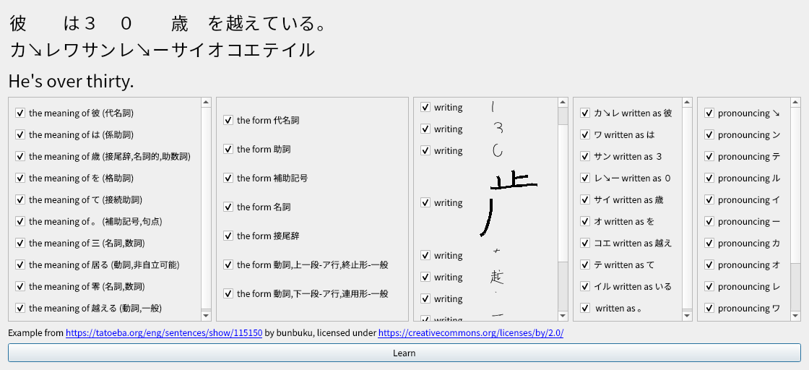

# Alphabet Soup

**Alphabet Soup** gives language learners easily digestible chunks for practice.

It does this by keeping track of how well you remember each vocabulary item,
including details like grammatical forms and pronunciation, and showing you an
example sentence when it's time to refresh your memory. Currently, Japanese is
the only supported language.

## Installation and Usage

This project is very immature and is severely lacking in documentation. Use at
your own risk. It has only been tested on a single Linux machine so far.
You may be able to install it on another machine by following the steps below.

### Installation

First, install the required Python dependencies in a virtual environment
by running
```bash
make setup
```

To create the sentence database, run
```bash
make data/new_jpn_sentences.sqlite
```
This will take a few hours to download everything and process the data.
If you get errors, those are probably due to missing non-Python dependencies.
Hopefully you can figure out how to install them.

If the command executes successfully, move the resulting file to a new location.
```bash
mv data/new_jpn_sentences.sqlite data/jpn_sentences.sqlite
```

Then generate the dictionary
```bash
make data/jpn_dictionary.sqlite
```

And the animated stroke order diagrams for all kanji
```bash
make kanjivg-gifs
```

### Usage

To learn a new Japanese sentence with English or Mandarin Chinese translations, run
```bash
virtualenv/bin/python ./spoon.py recommend-sentence --translation-languages eng cmn
```
This will take a few minutes for the first few runs because the most common
words appear in almost every sentence.

The `--translation-languages` parameter accepts a list of [ISO 639 three-letter
codes](https://en.wikipedia.org/wiki/List_of_ISO_639-2_codes). Translations are
prioritized in the order in which their languages appear. If there are multiple
possible translations in the same language, only one is shown. The checkboxes
in theory allow choosing which details of the sentence to learn. In practice
you'll just see a different sentence with the same details the next time you run
the command.

To practice what you learned, run
```bash
virtualenv/bin/python ./spoon.py review --translation-languages eng cmn
```
There are two kinds of review. The first is dictation, where you listen to the
recording and should try to write down what you hear on paper. The second is
reading, where you should try to read the sentence aloud.
In each case, you'll have to manually check whether you made any mistakes and
indicate them by unticking the corresponding checkbox. Those details will then
be scheduled for review more frequently.



Dictionary entries for the words in the left column are displayed in a tooltip
on mouseover, if available. The stroke order diagrams are animated, so the
screenshot really ought be to a GIF.

## Testimonial by the Author

> When I started building this for learning Japanese, I already knew a little
(half-forgotten hiragana and katakana, also many kanji because I speak Mandarin),
but I was only able to create this program by making use of existing tools for
the language-specific features. I've just glued them together.

> After a year of daily use, there are now 35611 sentences in my database which
could potentially be scheduled for review (which means that, theoretically,
I should be able to understand them), 21.3% of the total. The ebook which I
should understand the best (35% of all sentences) is the [Japanese translation
of Karel Čapek's play "Rossum's Universal Robots"](https://www.aozora.gr.jp/cards/001236/files/46345_23174.html).
35% understanding is... not enough to allow me to read it from beginning to end,
but occasionally I get a nice sentence e.g. about the worldwide robot uprising.

## Implementation Details

There are two main sources of example sentences: 52114 from [Tatoeba](https://tatoeba.org),
most of which have translations, and 114591 extracted from public-domain ebooks
from [Aozora Bunko](https://www.aozora.gr.jp/), some of which use rather archaic
language.

Each sentence is processed using [Kuromoji](https://github.com/atilika/kuromoji)
to segment it into individual words and get details like part-of-speech tags,
dictionary forms (lemmas) and pronunciation for each one. Then they are added to
a SQLite database.

Some sentences on Tatoeba have audio recordings contributed by native speakers,
but there aren't so many for Japanese, so the remaining sentences have a robotic
pronunciation by [Open JTalk](http://open-jtalk.sourceforge.net/).
That pronunciation may differ from the one determined by
Kuromoji, which should be used as a consistency check. Hopefully, they're not
both wrong at the same time.

Various criteria for determining what to learn next have been tried. One that
worked well is to keep track of the least frequent unknown detail of each
sentence (e.g. the spelling of a particular word) and pick the sentence where
that frequency is highest. That way, sentences with common words come first.
Lately, this has been modified a bit to also consider how many other sentences
have the same least frequent unknown detail, so that there are always multiple
different examples available to help with generalization.

Reviews are scheduled for each detail based on the time since the last review
and the time when they last had to be relearned. The are plans to tune the
review schedule based on past performance, but right now it just doubles the
interval between reviews after every successful review.

The sentence for each detail with a scheduled review used to be picked uniformly
at random, but that would sometimes randomly schedule the same sentence often
enough for the repetition to be noticeable. To avoid that, sentences that have
never been seen or not been seen in a long time are now preferred.

It should be possible to adapt the system to work for other languages, but that
would require significant refactoring to remove the assumption that everything
is in Japanese.
